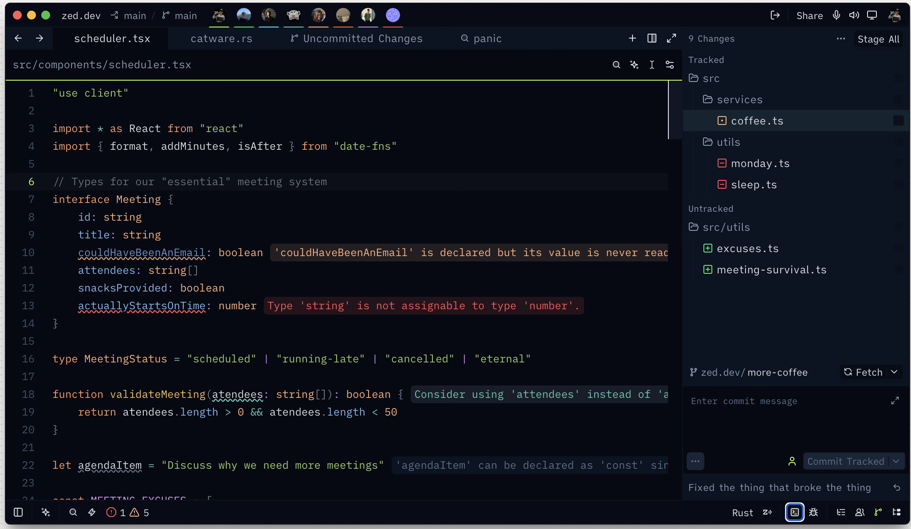
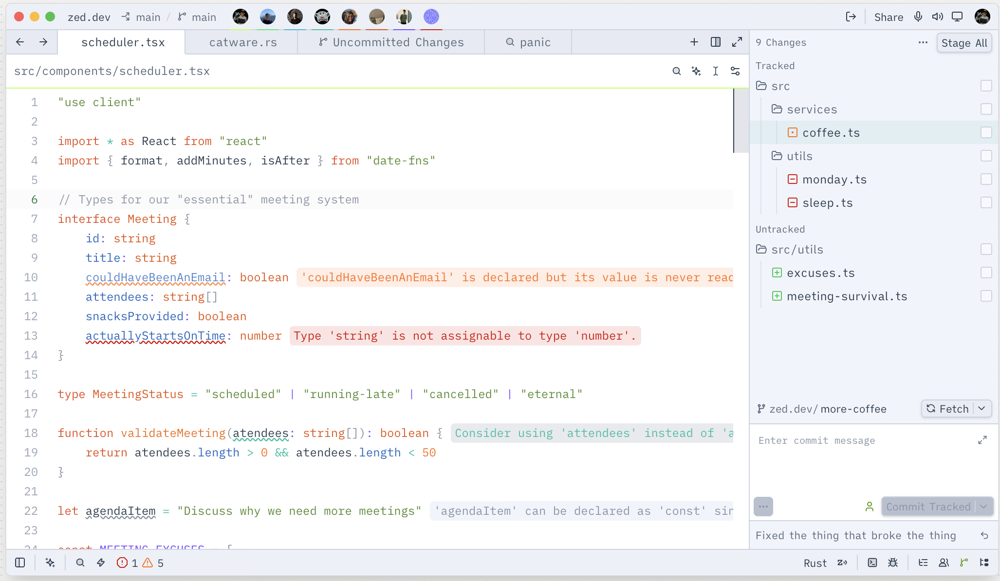

# Verdant Phosphor

A meticulously crafted colour theme for the [Zed](https://zed.dev) code editor, available in both **dark** and **light** variants.

> Slate-blue depths kissed by phosphorescent lime. A theme that favours readability without sacrificing style.

<details>
<summary><b>📸 Screenshots</b></summary>

**Dark**



<br>

**Light**



</details>

---

## ✦ Character

**Verdant Phosphor** bridges two sensibilities: the cool, blue-tinted slate backgrounds provide a calm, distraction-free canvas, whilst the phosphorescent lime accents (`#bbfd50`) inject just enough energy to keep the interface alive. Every element has been tuned by hand — border weights, indent guides, line numbers, and hover states — to produce a cohesive, polished experience across the entire editor surface.

### Palette at a Glance

| Role                   | Dark                   | Light                    |
| ---------------------- | ---------------------- | ------------------------ |
| Editor background      | `#060914`              | `#ffffff`                |
| Panel / sidebar        | `#0b1322`              | `#f1f4fb`                |
| Primary text           | `#dce0e6`              | `#2c3e50`                |
| Accent (phosphor lime) | `#bbfd50`              | `#bbfd50`                |
| Keywords               | `#ff9e64` (warm coral) | `#e64a19` (deep orange)  |
| Strings                | `#9acd6a` (chartreuse) | `#558b2f` (olive)        |
| Functions              | `#f5c060` (amber)      | `#ef6c00` (burnt orange) |
| Types                  | `#ffb380` (peach)      | `#e65100` (russet)       |
| Constants / numbers    | `#d49ef0` (lavender)   | `#7c4dff` (violet)       |
| Comments               | `#667280` _italic_     | `#8d97a5` _italic_       |

---

## ✦ Design Principles

### Contrast That Cares

All text colours meet **WCAG AA** contrast ratios against their respective backgrounds. Primary text achieves ≥ 10:1 in both variants; even muted and disabled text remains comfortably above 3:1. Line numbers, indent guides, and scrollbars are present but deliberately understated — visible when you need them, quiet when you do not.

### Italic Where It Counts

Inspired by Catppuccin's thoughtful use of typographic emphasis, the following tokens are set in italic:

- All comments (`comment`, `comment.doc`, `comment.todo`, etc.)
- `module`, `namespace`, `type.builtin`, `type.interface`, `type.super`
- `tag.attribute`, `emphasis`, `link_uri`, `string.doc`, `string.special.url`
- `variable.special`, `hint`

### Borderless, Not Boundless

General-purpose borders are kept subtle and slate-toned. The phosphor lime only appears where it matters: focused panes, selected elements, the active line number, and hovered indent guides. This restraint ensures the accent colour signals attention rather than shouting for it.

---

## ✦ Installation

### Local (recommended)

```sh
# Create the Zed themes directory if it does not exist
mkdir -p ~/.config/zed/themes

# Copy the theme file
cp themes/verdant-phosphor.json ~/.config/zed/themes/
```

Then open Zed, press **Cmd + K, Cmd + T**, and select either **Verdant Phosphor Dark** or **Verdant Phosphor Light**.

### Via Zed Extensions

Once accepted into the Zed extension registry, this theme will be installable directly from the Extensions panel inside the editor.

### Dev Installation

To test the latest version before it's published:

1. Clone this repository
2. In Zed, open the Extensions panel (`Cmd + Shift + X`)
3. Click **Install Dev Extension** and select the cloned directory

---

## ✦ File Structure

```
zed-verdant-phosphor/
├── extension.toml              ← extension manifest
├── themes/
│   └── verdant-phosphor.json   ← theme definition
├── screenshots/
│   ├── dark.png
│   └── light.png
├── LICENSE                     ← MIT
└── README.md
```

---

## ✦ Acknowledgements

This theme draws inspiration from:

- **[Catppuccin](https://github.com/catppuccin/zed)** — for its thoroughness, italic usage patterns, and the full breadth of token coverage.
- **[Ayu](https://github.com/ayu-theme/ayu-colors)** — for its warm, distinctive syntax palette and the courage to use very dark backgrounds.

Verdant Phosphor is neither; it is a conversation between the two, spoken in green.

---

## ✦ Licence

MIT © 2026 [Homero Lucas do Prado](https://github.com/hlucas13)
